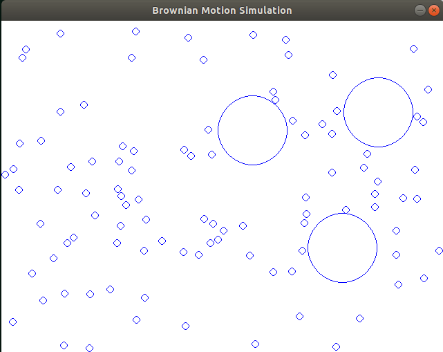

# Brownian Motion Simulation

# Overview
This project simulates a movement of many particles(e. g. H20 molecules) that collides with a bigger particle(e. g. pollen grain). The movement is completely random(known as random walks).

# Enviroment
- language: c++11
- compilator: g++7.3.0
- graphics: SDL2(https://www.libsdl.org/download-2.0.php)

# Architecture
Every particle has got its own position, radius, mass and vector representing its velocity and direction.

It finds the two particles that are colliding first and the time when the collision occurs. Then the collision time is splitted into the same parts that are displayed. After the collision time the program calculates the new vector of the particles that collided. This process is repeated.
